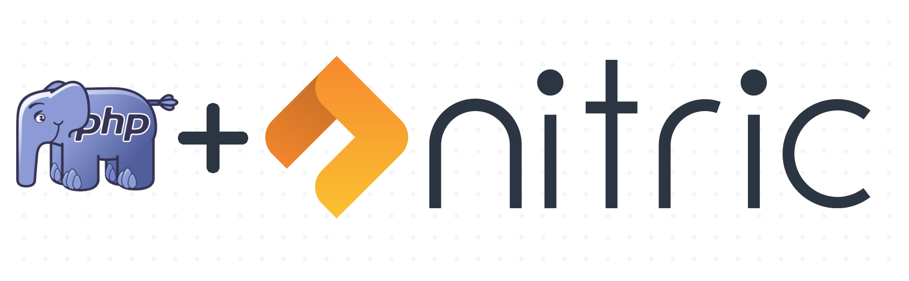

<p align="center">
  
</p>

# PHP SDK
The PHP SDK supports the use of the cloud-portable Nitric framework with PHP 8+.

>The SDK is in early stage development and APIs and interfaces are still subject to breaking changes

## Prerequisites
 - PHP 8+ 

## Getting Started
> The PHP SDK is included by all nitric PHP templates by default

### Using the Nitric CLI
```bash
nitric make:function <php-template> example
```

Available PHP templates are:
* faas/php8

Adding to an existing project (Composer)
```bash
composer require nitric/sdk
```

